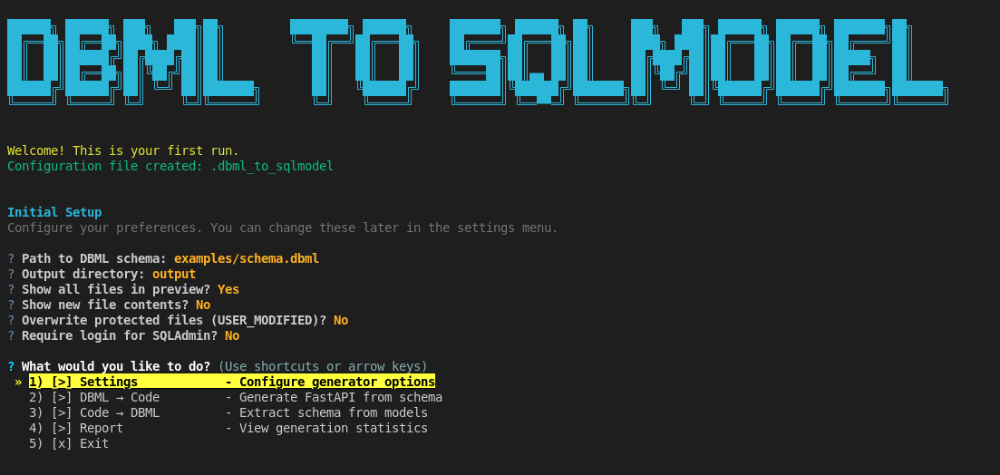
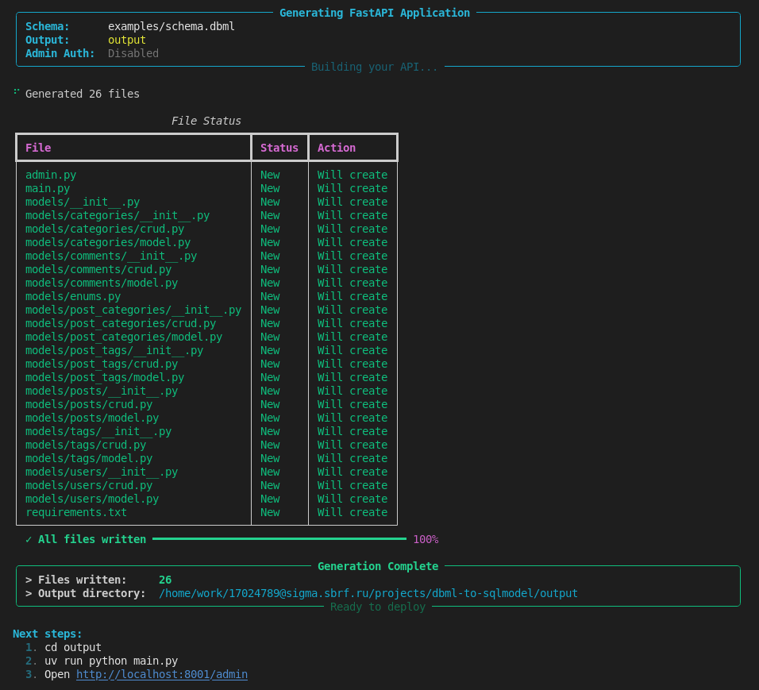
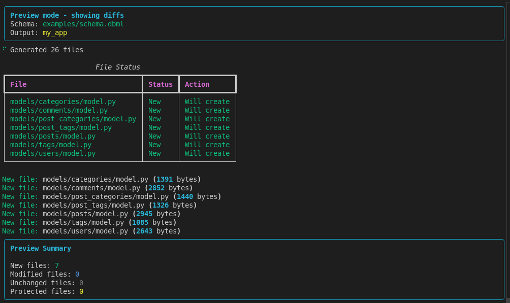
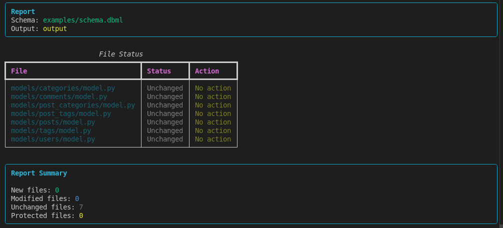
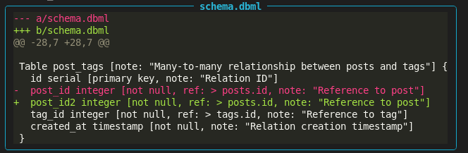
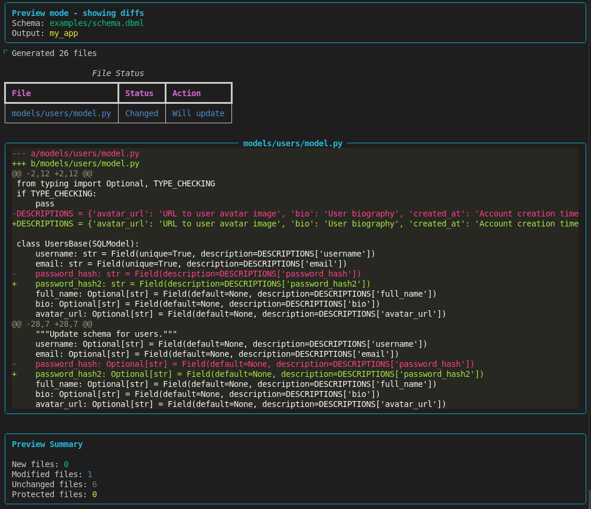

# CLI Guide

Complete guide to using the `dbml-to-sqlmodel` CLI.

## Table of Contents

- [Installation](#installation)
- [Interactive Mode](#interactive-mode)
- [Commands](#commands)
  - [generate](#generate)
  - [preview](#preview)
  - [info](#info)
  - [code-to-dbml](#code-to-dbml)
- [Configuration](#configuration)
- [File Protection](#file-protection)
- [Examples](#examples)
- [Troubleshooting](#troubleshooting)

## Installation

### Code generation only

```bash
pip install dbml-to-sqlmodel
```

### To run the generated applications

```bash
pip install "dbml-to-sqlmodel[runtime]"
```

## Interactive Mode



```bash
dbml-to-sqlmodel
# or from the repository
make cli
```

On the very first run, an **Initial Setup** wizard lets you configure a few options.

**In order:**

```text
1. Path to DBML schema:                       # Choose the DBML file
2. Output directory:                           # Output folder
3. Show all files in preview?:                 # Show the full list or only changes
4. Show new file contents?:                    # Preview the content of new files
5. Overwrite protected files (USER_MODIFIED)?: # Force-overwrite protected files
6. Require login for SQLAdmin?:                # Whether to require an admin password
```

> The SQLAdmin credentials are managed through environment variables — see
> [.env.example](../.env.example).

After that, the interactive menu becomes available:

```text
1) [>] Settings           # - Configure generator options
2) [>] DBML → Code        # - Generate FastAPI from schema
3) [>] Code → DBML        # - Extract schema from models
4) [>] Report             # - View generation statistics
5) [x] Exit
```

## Commands

### generate

Generate a FastAPI application from DBML.

```bash
dbml-to-sqlmodel generate <schema.dbml> [-o <folder>] [--admin-auth] [--force]
```

**Example:**

```bash
dbml-to-sqlmodel generate schema.dbml -o my_app --admin-auth
```



### preview

Preview changes **without writing** any files.

```bash
dbml-to-sqlmodel preview schema.dbml -o my_app
```



**Output:**

```text
📁 models/users/model.py     UPDATE
📁 models/posts/crud.py      CREATE
📁 users/__init__.py         SKIP (USER_MODIFIED)  ← Protected!
```

### info

Show information about the schema and the generated files.

```bash
dbml-to-sqlmodel info schema.dbml
```



### code-to-dbml

Reverse conversion: generated code → DBML.

```bash
dbml-to-sqlmodel code-to-dbml output -o backup.dbml
```



## Configuration

**.dbml_to_sqlmodel** (JSON, saved automatically):

```json
{ "schema_file": "schema.dbml", "output_dir": "output" }
```

**.env** (for the generated applications):

```env
DATABASE_URL=sqlite+aiosqlite:///./db.db
ADMIN_USER=admin
ADMIN_PASS=pass
ADMIN_SECRET=at_least_32_characters_secret
```

## File Protection

Add this marker to the top of a file:

```python
# USER_MODIFIED
```

**Result:** the file is shown as `SKIP` in preview; use `--force` to overwrite it.

## Examples

### Full workflow

```bash
cat > schema.dbml <<'EOF'
Table users { id integer [pk], username varchar [unique] }
EOF

dbml-to-sqlmodel info schema.dbml      # Inspect
dbml-to-sqlmodel preview schema.dbml   # Preview
dbml-to-sqlmodel generate schema.dbml  # Generate

cd output
echo "DATABASE_URL=sqlite+aiosqlite:///./db.db" > .env
python main.py                         # Run
```

### Updating an existing project

```bash
# After adding a column to schema.dbml
dbml-to-sqlmodel preview schema.dbml -o my_app
# ✅ Shows only the changes
dbml-to-sqlmodel generate schema.dbml -o my_app
```



## Troubleshooting

**Command not found:**

```bash
pipx install dbml-to-sqlmodel
```

**Admin panel does not work:**

```text
ADMIN_SECRET must be at least 32 characters long!
```

## Reference

```bash
dbml-to-sqlmodel --help
dbml-to-sqlmodel generate --help
dbml-to-sqlmodel --version
```

## See Also

- [README](../README.md)
- [DBML documentation](https://dbml.org/docs/)
- [FastAPI](https://fastapi.tiangolo.com/)
